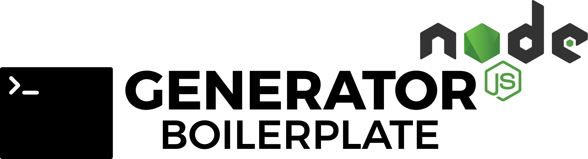
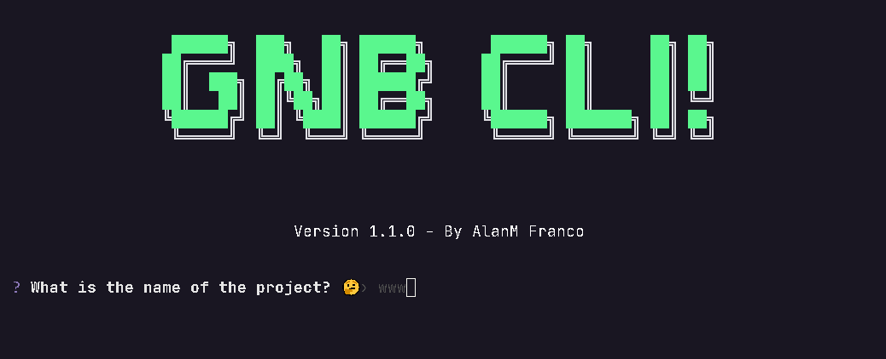

<h1 align="center">
  
</h1>

  <a href="#-projeto">Projeto</a>&nbsp;&nbsp;&nbsp;|&nbsp;&nbsp;&nbsp;
  <a href="#-layout">Como usar</a>&nbsp;&nbsp;&nbsp;|&nbsp;&nbsp;&nbsp;
  <a href="#-tecnologias">Tecnologias</a>&nbsp;&nbsp;&nbsp;|&nbsp;&nbsp;&nbsp;
  <a href="#-Como contribuir">Como contribuir</a>&nbsp;&nbsp;&nbsp;|&nbsp;&nbsp;&nbsp;
  <a href="#memo-licença">Licença</a>

  

  

 

  

## **💻 Projeto**

O GNB (Generator NodeJS Boilerplates) foi criado para automatizar a tarefa de criar um template de node tudo do zero toda a vez que você inicia um novo projeto, ou seja, ele vem pra facilitar no desenvolvimento do seu novo projeto com configurações essenciais para você desenvolver sem perder muito tempo configurando coisas basicas.

## **✨ Como usar**

Para sair usando o GNB será necessário instalar [Node.js](https://nodejs.org/) ou já ter ele instalado.

Em seguida você deve instalar o pacote com o comando
**`npm install node-generator-boilerplate` ou `yarn add node-generator-boilerplate`**

Logo após de instalar o pacote você utiliza o comando: **`generator-node`** ou **`create-node-app`** e pronto você já pode desfrutar da CLI.

## **🚀 Tecnologias**

Esse projeto foi desenvolvido com as seguintes tecnologias:

- JavaScript
- Node.js
- Prompts
- CFonts

## **✅ Features**

Algumas funcionalidades já presentes no projeto.

- [] Templates
  - [x] Express + JavaScript CLEAN!!
  - [x] Express + TypeScript CLEAN!!
  - [x] Express + Javascript + ESLint + Prettier
  - [x] Express + Typescript + ESLint + Prettier
  - [x] Koa + Javascript
  - [x] Koa + Typescript
  - [x] Fastify + Javascript
  - [] Fastify + Typescript

## 🤔 Como contribuir

- Faça um fork desse repositório;
- Cria uma branch com a sua feature: `git checkout -b minha-feature`;
- Faça commit das suas alterações: `git commit -m 'feat: Novo template'`;
- Faça push para a sua branch: `git push origin minha-feature`.

Depois que o merge da sua pull request for feito, você pode deletar a sua branch.

## **:memo: Licença**

Esse projeto está sob a licença MIT. Veja o arquivo [LICENSE](LICENSE.md) para mais detalhes.

---

Feito com 💚 by AlanM Franco [Visite meu Portfolio!](https://alnmaurofranco.github.io/)
